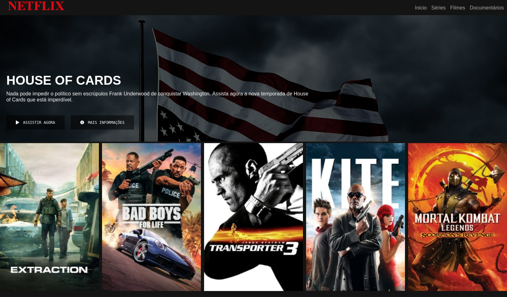

# Netflix Clone

Clone full-stack da interface da Netflix com **React 19 + TypeScript + Vite** (frontend), **Node.js + Express + TypeScript** (backend/API) e **Docker/docker-compose** (dev e produção).



## Funcionalidades

- **Header** fixo com logo, navegação e perfil (gradiente ao rolar)
- **Banner Hero** com filme em destaque, match %, botões "Assistir Agora" e "Mais Informações"
- **Carrossel de filmes** custom (CSS scroll-snap) por fileiras: Top 10, Tendências, Originais etc.
- **Footer** no padrão Netflix
- **API REST própria** (`/api`) com catálogo mock servido de JSON
- **Docker**: dev com hot-reload e produção com Nginx
- **Design responsivo** (320px a 1920px)
- **Tema escuro** Netflix (`#141414` / `#E50914`)

## Stack

| Tecnologia | Versão |
|---|---|
| React | ^19.2.7 |
| TypeScript | ~6.0.2 |
| Vite | ^8.1.0 |
| Express | ^5.x |
| Oxlint | ^1.69.0 |
| Docker / docker-compose | — |

## Requisitos

- Node.js 24+ (para desenvolvimento local)
- Docker + Docker Compose (para rodar containerizado)

## Como rodar

### Desenvolvimento (Docker, hot-reload) — padrão

```bash
docker compose up --build
```

- Frontend (Vite): http://localhost:5173
- API (tsx watch): http://localhost:4000/api

O `docker-compose.override.yml` é carregado automaticamente e monta os
volumes com hot-reload (alterações em `src/` e `server/src/` são refletidas
na hora).

### Produção (Docker)

```bash
docker compose -f docker-compose.yml up --build
```

- Frontend: http://localhost:8080 (Nginx, com proxy `/api`)
- API: http://localhost:8080/api

### Desenvolvimento local (sem Docker)

```bash
# Terminal 1 — backend
cd server && npm install && npm run dev

# Terminal 2 — frontend
npm install && npm run dev
```

## Scripts

| Comando | Descrição |
|---|---|
| `npm run dev` | Dev server do frontend (Vite) |
| `npm run build` | Build de produção (tsc + vite) |
| `npm run lint` | Oxlint |
| `npm run preview` | Preview do build |
| `cd server && npm run dev` | Backend com hot-reload |
| `cd server && npm run build` | Compila backend (tsc) |
| `cd server && npm start` | Backend em produção |

## Estrutura

```
├── docker-compose.yml
├── docker-compose.override.yml  # Dev (hot-reload, auto-carregado)
├── Dockerfile                   # Frontend multi-stage (node → nginx)
├── nginx.conf                   # SPA fallback + proxy /api
├── src/                         # Frontend React
│   ├── components/              # Header, HeroBanner, MovieRow, MovieCard, Footer
│   ├── api/                     # Cliente HTTP (/api)
│   ├── hooks/                   # useCatalog
│   └── types/                   # Tipos compartilhados
├── public/images/               # Assets (capa-house, mini1-10)
└── server/                      # Backend Express
    └── src/
        ├── routes/              # catalog, movies, genres, featured, health
        └── data/catalog.json    # Catálogo mock
```

## API

| Endpoint | Descrição |
|---|---|
| `GET /api/health` | Health check |
| `GET /api/catalog` | Catálogo completo (herói + fileiras) |
| `GET /api/movies` | Todos os filmes (filtros: `?genre=` e `?type=`) |
| `GET /api/movies/:id` | Detalhe de um filme |
| `GET /api/genres` | Lista de gêneros |
| `GET /api/featured` | Filme em destaque (banner hero) |

Mais detalhes técnicos no [PRD.md](./PRD.md).
